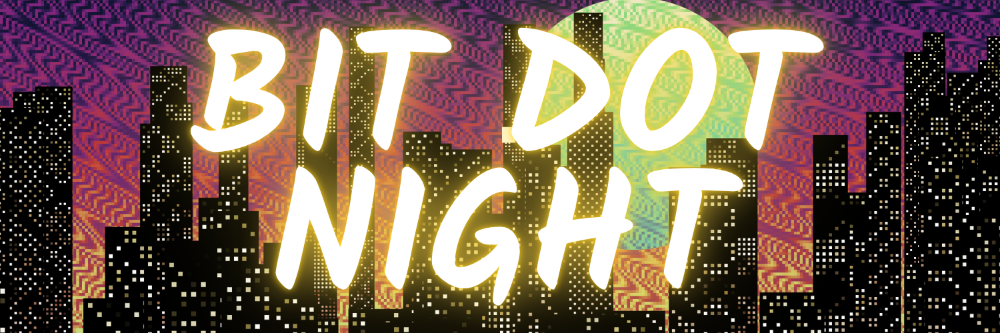
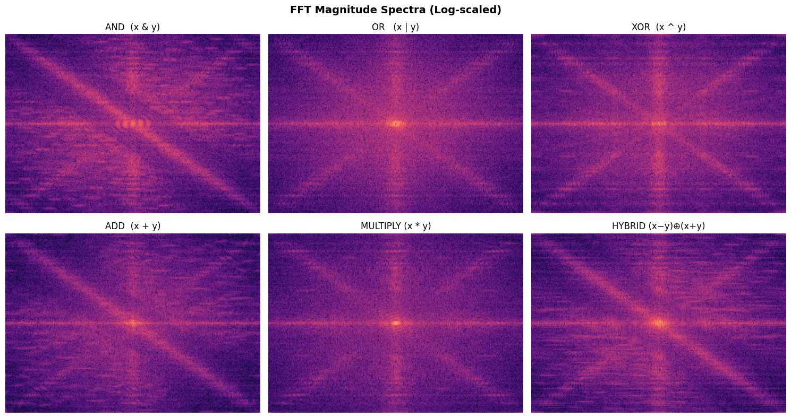
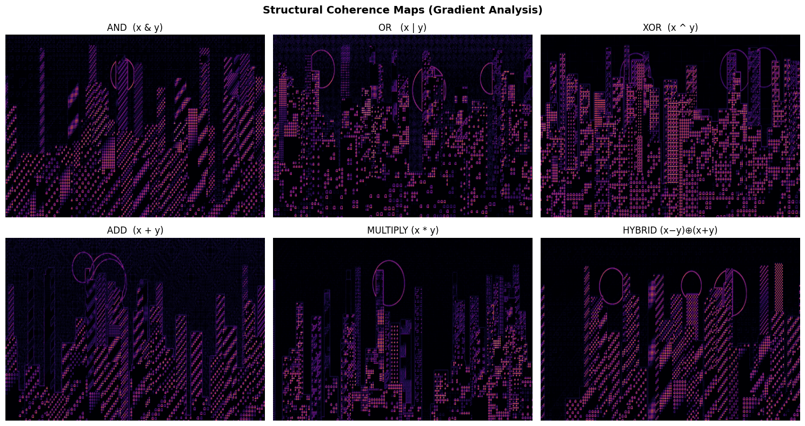

<div align="center">

<picture>
  <source media="(prefers-color-scheme: dark)" srcset="images/HEADER.png">
  
</picture>

# Bit Dot Night
# Bitwise Generative Systems for Emergent Architectural Visualization
*The first deterministic discrete-operator generative architecture for procedural urban morphology:*  
*A computational art paradigm transcending continuous Perlin noise and explicit geometric grammars.*

**第一個以位元邏輯與整數運算為核心的程序化都市景觀架構**  
**超越傳統柏林噪聲與幾何語法的確定性生成新範式**

---

[](https://github.com/dkconnect/bit-city/stargazers)
[](https://github.com/dkconnect/bit-city/network/members)
[](https://github.com/dkconnect/bit-city/watchers)

[](Bit%20Dot%20Night%20Rev%20-%20JULY.pdf)
[](https://bit-city.vercel.app/)
[](script.js)
[](bit-dot-night.ipynb)
[](script.js)
[](LICENSE)

[](https://linkedin.com)
[](https://github.com/dkconnect)


**Computational Media & Algorithmic Art · Dibyanshu Kumar**

---

### The Core Paradigm — Visual Structure from Binary Logic

<div align="left">

> *Strip away Perlin noise fields, hand-drawn vector assets, and procedural grammar trees, and what remains is the algebraic structure of integer arithmetic and bitwise logic evaluated over a 2D coordinate lattice. **That emergent morphology is what we generate.** Not random noise: a deterministic, infinite architectural skyline emerging directly from low-level binary interactions.*

[](https://bit-city.vercel.app/)

**One click, zero build steps:** Open `index.html` or visit the [Live Demo](https://bit-city.vercel.app/) — an interactive, 60 FPS dual-canvas procedural world engine featuring:

- **Discrete Coordinate Fields:** Evaluates parameterized integer operators $f(x, y) = \mathcal{O}(x + s_x, y + s_y)$ directly on coordinate grids with deterministic offsets $(s_x, s_y)$.
- **Periodic Cosine Luminance Mapping:** Continuous periodic luminance $L(x, y) = \cos(f(x, y) \cdot k)$ translates raw integer fields into smooth, wave-like lighting and rhythmic facade banding.
- **Dual-Layer Render Pipeline:** Static ultra-high-resolution ($4096 \times 2048$) offscreen background pass decoupled from dynamic $60\text{ FPS}$ procedural facade synthesis.
- **Quantitative Aesthetic Metric Suite:** Mathematical verification of emergent visual complexity via 2D Fast Fourier Transform (FFT) spectral energy partitioning, structural coherence gradients ($C$), and brightness variance ($\sigma^2$).

**The Quantitative Benchmark — Measurable grounds for aesthetic complexity.**
Evaluated across 100 independent seed configurations per operator class sampled via the SFC32 PRNG:

- **`AND` (Masking Parity):** Low variance ($\sigma^2 = 0.02645$), high low-band clustering ($E_{\text{low}} = 37.6\%$), dense building facades.
- **`XOR` (Bit Discontinuity):** High local variance ($\sigma^2 = 0.05103$), high structural dispersion ($C = 0.08984$), fine-grained window matrix.
- **`HYBRID` Interference $(x-y) \oplus (x+y)$:** Computed Moiré patterns balancing macro-level stability ($E_{\text{low}} = 65.3\%$) with intricate local detail ($C = 0.05958$).

No "hand-tuned geometry" claim — buildings, skyscrapers, windows, and illuminated skylines are **perceptual consequences of bitwise logic and human visual edge detection**.

[](bit-dot-night.ipynb)

[](bit-dot-night.ipynb)

*How the visual taxonomy is verified — **(a)** Log-scaled 2D FFT Magnitude Spectra demonstrating spatial frequency partitioning; **(b)** Structural Coherence Gradient Maps measuring localized pixel variation; **(c)** HSL color transformation with vertical atmospheric gradients.*

**What makes this possible? Three breaks with traditional generative workflows:**

**① Pure Integer Substrate over Continuous Noise:** Unlike shader art relying on simplex noise or signed distance fields, the visual morphology here is driven entirely by discrete binary primitives (`AND`, `OR`, `XOR`, `ADD`, `MULT`, `HYBRID`).

**② 2D Extension of the Bytebeat Tradition:** Extending Viznut's 1-dimensional algorithmic audio formulas ($t \& (t \gg 8)$) into a two-dimensional spatial coordinate system $(x, y)$, mapping time into vertical stacking cues and sound waves into luminance.

**③ Verifiable Seed Determinism via SFC32:** Full compatibility with cryptographic hash-based minting systems (e.g., fxhash) using a 32-bit counter-based PRNG passing the BigCrush statistical suite.

</div>

### The Engine in Motion

<div align="left">


*Procedural cityscape scrolling infinitely in real time: (A) Offscreen buffer drawing composite sky & moons; (B) Procedural facade generation with dynamic vertical displacement $Y(t) = Y_0 + vt$; (C) Dynamic glowing neon atmospheric shadow.*

```bash
# Clone & run locally with zero dependencies
git clone [https://github.com/dkconnect/bit-city.git](https://github.com/dkconnect/bit-city.git)
cd bit-city
python -m http.server 8000

```

---

## The Story

> It started with a fundamental question at the intersection of low-level computer science and visual perception:
> **Why do we need complex geometric primitives and heavy noise libraries to draw an urban skyline?**
> In low-level computing, bitwise operations (`&`, `|`, `^`) are treated merely as performance tools for bitmasks and arithmetic logic. But when integer operations are evaluated across a two-dimensional lattice, their outputs encode implicit spatial regularities, shared bit patterns, periodicity, and interference.
> The human eye naturally interprets vertical stacking, horizontal repetition, and localized brightness grids as architecture: **windows, skyscrapers, and city blocks**. By passing binary fields through a periodic cosine transform, discrete logic transforms into a living, breathing cyberpunk metropolis.

---

## Table of Contents

1. [The Computational Philosophy](https://www.google.com/search?q=%23the-computational-philosophy)
2. [Mathematical Foundations](https://www.google.com/search?q=%23mathematical-foundations)
3. [Operator Taxonomy & Visual Regimes](https://www.google.com/search?q=%23operator-taxonomy--visual-regimes)
4. [Quantitative Aesthetic Analysis (FFT & Coherence)](https://www.google.com/search?q=%23quantitative-aesthetic-analysis-fft--coherence)
5. [System Architecture & Render Pipeline](https://www.google.com/search?q=%23system-architecture--render-pipeline)
6. [Deterministic PRNG (SFC32)](https://www.google.com/search?q=%23deterministic-prng-sfc32)
7. [Repository Structure](https://www.google.com/search?q=%23repository-structure)
8. [Quick Start & Local Setup](https://www.google.com/search?q=%23quick-start--local-setup)
9. [Empirical Analysis Notebook](https://www.google.com/search?q=%23empirical-analysis-notebook)
10. [Citation](https://www.google.com/search?q=%23citation)

---

## The Computational Philosophy

Traditional computer graphics and procedural generation rely heavily on continuous trigonometric equations, Perlin/Simplex noise, and explicit Shape Grammars. **Bit Dot Night** rejects these abstractions:

| Architectural Dimension | Continuous Noise / Vector Methods | Bit Dot Night (Bitwise Substrate) |
| --- | --- | --- |
| **Underlying Primitive** | Floating-point interpolation, Perlin noise | Discrete integer coordinates $x, y \in \mathbb{N}$ & binary logic |
| **Architectural Form** | Explicit 3D meshes / L-System grammars | Emergent perceptual consequence of bitwise parity |
| **Computational Footprint** | Heavy matrix transforms & GPU shaders | Pure lightweight integer CPU/2D canvas operations |
| **Luminance Mapping** | Linear texture blending & lighting models | Periodic Cosine Transform $L = \cos(f(x, y) \cdot k)$ |
| **Reproducibility** | Platform-dependent floating-point drift | Seed-deterministic SFC32 PRNG (BigCrush verified) |

---

## Mathematical Foundations

### 1. Discrete Coordinate Space & Operator Evaluation

Let the canvas domain be a discrete lattice $x \in [0, W], y \in [0, H] \subset \mathbb{N}$. Given seed offsets $(s_x, s_y)$, coordinate variables are mapped as $X = x + s_x$ and $Y = y + s_y$:

$$\begin{aligned}
\text{AND:} \quad & f(x, y) = X \ \& \ Y \\
\text{OR:} \quad & f(x, y) = X \ \mid \ Y \\
\text{XOR:} \quad & f(x, y) = X \oplus Y \\
\text{ADD:} \quad & f(x, y) = X + Y \\
\text{MULTIPLY:} \quad & f(x, y) = X \cdot Y \\
\text{HYBRID:} \quad & f(x, y) = (X - Y) \oplus (X + Y)
\end{aligned}$$

### 2. Periodic Cosine Luminance Mapping

Raw integer logic produces harsh binary steps. To introduce organic light gradients without losing underlying symmetry, the integer field is passed through a periodic cosine mapping modulated by a frequency scaling factor $k$:

$$L(x, y) = \cos\Big(f(x, y) \cdot k\Big), \quad k \in \mathbb{R}^+$$

### 3. Spatial Color Mapping in HSL Space

Color is calculated deterministically by coupling the operator scalar output with spatial coordinates:

$$H(x, y) = \alpha + \beta \cdot f(x, y) + \gamma \cdot y$$

The vertical gradient coefficient $\gamma \cdot y$ enforces atmospheric depth—shifting the upper sky into deep purples/blues and lower building zones into warm neon accents.

---

## Operator Taxonomy & Visual Regimes

```
                      ┌────────────────────────────────────────┐
                      │    Discrete Operator Field f(x, y)     │
                      └───────────────────┬────────────────────┘
                                          │
         ┌────────────────────────────────┼────────────────────────────────┐
         ▼                                ▼                                ▼
┌─────────────────┐              ┌─────────────────┐              ┌─────────────────┐
│ Bitwise Masking │              │ Arithmetic Sum  │              │ Chaotic Moiré   │
│  (AND, OR, XOR) │              │  (ADD, MULT)    │              │    (HYBRID)     │
└────────┬────────┘              └────────┬────────┘              └────────┬────────┘
         │                                │                                │
         ▼                                ▼                                ▼
  Dense Facades &                  Sloped Rooflines &              Complex Intersecting
 Window Grid Textures              Gradient Recessions               Symmetric Forms

```

| Operator | Formula | Visual Trait | Structural Behaviour & Perceptual Interpretation |
| --- | --- | --- | --- |
| **`AND`** | $X \ \& \ Y$ | Dense blocks | Preserves shared higher-order bitplanes; produces dense building masses. |
| **`OR`** | $X \ \mid \ Y$ | Expanding forms | Expands set bits; generates mid-frequency modular city clusters. |
| **`XOR`** | $X \oplus Y$ | Noise-like windows | Maximizes bit transitions; yields high-frequency illuminated window matrices. |
| **`ADD`** | $X + Y$ | Sloped gradients | Directional linear gradients; creates diagonal roofs and perspective slopes. |
| **`MULT`** | $X \cdot Y$ | Sparse bursts | Non-linear arithmetic scaling; generates sparse, high-contrast focal monoliths. |
| **`HYBRID`** | $(X-Y) \oplus (X+Y)$ | Chaotic symmetry | Algebraic wave interference; produces computed Moiré patterns. |

---

## Quantitative Aesthetic Analysis (FFT & Coherence)

Quantitative metrics computed across 100 independent seed generations per operator at $2048 \times 2048$ resolution using `bit-dot-night.ipynb`:

| Operator | Formula | Variance ($\sigma^2$) | $E_{\text{low}}$ (%) | $E_{\text{mid}}$ (%) | $E_{\text{high}}$ (%) | Coherence ($C$) | Dominant Spatial Behavior |
| --- | --- | --- | --- | --- | --- | --- | --- |
| **AND** | $X \ \& \ Y$ | `0.02645` | `37.6%` | `19.0%` | `43.4%` | `0.06571` | Dense clustering, high structural massing |
| **OR** | $X \ \mid \ Y$ | `0.04059` | `57.8%` | `17.8%` | `24.4%` | `0.06304` | Modular expansion, balanced frequency |
| **XOR** | $X \oplus Y$ | `0.05103` | `53.5%` | `15.9%` | `30.6%` | `0.08984` | High-frequency window texture |
| **ADD** | $X + Y$ | `0.03121` | `73.3%` | `10.5%` | `16.2%` | `0.06123` | Directional gradient, low mid-band |
| **MULT** | $X \cdot Y$ | `0.02552` | `71.0%` | `8.5%` | `20.5%` | `0.04777` | Highest spatial continuity (lowest $C$) |
| **HYBRID** | $(X-Y)\oplus(X+Y)$ | `0.04383` | `65.3%` | `11.1%` | `23.6%` | `0.05958` | Dual-frequency symmetric Moiré |

### Metric Definitions

1. **Brightness Variance ($\sigma^2 = \text{Var}(L)$):** Quantifies global contrast and tonal range across the scene.
2. **2D Fast Fourier Transform Partitioning ($E = \sum |F(u, v)|^2$):** Radial spectral bands ($E_{\text{low}} \le 15\%$, $E_{\text{mid}} \in (15\%, 40\%]$, $E_{\text{high}} > 40\%$) quantifying macro-form vs. micro-ornamentation.
3. **Structural Coherence ($C$):** Discrete spatial gradient expectation $C = \mathbb{E}[|L(x,y) - L(x+1,y)| + |L(x,y) - L(x,y+1)|]$. Lower values indicate solid masses; higher values indicate granular window lights.

---

## System Architecture & Render Pipeline

```
┌─────────────────────────────────────────────────────────────────────────┐
│                        SFC32 PRNG / fxhash Seed                         │
└────────────────────────────────────┬────────────────────────────────────┘
                                     │
                                     ▼
┌─────────────────────────────────────────────────────────────────────────┐
│              Static Layer Pass (Offscreen Canvas 4096x2048)             │
│  • Evaluate Background Operator (i, j)                                  │
│  • Apply Cosine Luminance & Background Gradient                         │
│  • Render Moon Phase & Difference Masking Compositing                   │
└────────────────────────────────────┬────────────────────────────────────┘
                                     │
                                     ▼
┌─────────────────────────────────────────────────────────────────────────┐
│              Dynamic Foreground Pass (60 FPS Animation Loop)           │
│  • Vertical Coordinate Translation: Y(t) = Y_0 + vt                     │
│  • Evaluate Window Operator on Building Grid: i ∈ [0, 2w+1]             │
│  • Modulate Pixel Scale, Earthquake Jitter, & Rainbow/Grayscale Shaders │
│  • Composite to Main Viewport Canvas with Dynamic CSS Neon Aura         │
└─────────────────────────────────────────────────────────────────────────┘

```

---

## Deterministic PRNG (SFC32)

To guarantee exact reproducibility across browsers and web3 platforms (such as fxhash), random state is governed by the 32-bit counter-based **SFC32** (Small Fast Chaotic) generator:

```javascript
let sfc32 = (a, b, c, d) => {
    return () => {
        a |= 0; b |= 0; c |= 0; d |= 0;
        var t = (a + b | 0) + d | 0;
        d = d + 1 | 0;
        a = b ^ b >>> 9;
        b = c + (c << 3) | 0;
        c = c << 21 | c >>> 11;
        c = c + t | 0;
        return (t >>> 0) / 4294967296;
    }
}

```

---

## Repository Structure

```
bit-city/
│
├── index.html                           # App markup, Tailwind CDN, and Canvas layout
├── style.css                            # Retro aesthetics, neon box-shadow, responsiveness
├── script.js                            # SFC32 PRNG, ArtGenerator class, operator engine
├── Bit Dot Night Rev - JULY.pdf         # Complete 24-page peer-reviewed research paper
│
├── analysis/                            # Quantitative analysis toolkit
│   ├── bit-dot-night.ipynb              # Jupyter notebook for FFT & Coherence analysis
│   └── analysis_results.csv             # Computed statistical table for all operators
│
├── figures/                             # Figures, spectra, and architectural output
│   ├── and.png                          # AND operator render output
│   ├── or.png                           # OR operator render output
│   ├── xor.png                          # XOR operator render output
│   ├── add.png                          # ADD operator render output
│   ├── multiply.png                     # MULTIPLY operator render output
│   ├── hybrid.png                       # HYBRID operator render output
│   ├── fft_magnitude_spectra.png        # Log-scaled 2D FFT spectral plots
│   └── structural_coherence_maps.png    # Gradient analysis maps
│
└── LICENSE                              # MIT License

```

---

## Quick Start & Local Setup

The core generative engine is written in pure vanilla JavaScript and requires **zero external build pipelines, bundlers, or package managers**.

### 1. Run the Web Application

```bash
# Clone the repository
git clone [https://github.com/dkconnect/bit-city.git](https://github.com/dkconnect/bit-city.git)
cd bit-city

# Start a lightweight local server
python -m http.server 8000

```

Open `http://localhost:8000` in your web browser. Press the **Redo** button to re-seed or **Download** to save an ultra-high-resolution PNG snapshot.

### 2. Run the Quantitative Analysis Suite

```bash
# Install Python dependencies for FFT analysis
pip install numpy pillow matplotlib scipy pandas

# Execute analysis script
python -c "import pandas as pd; df = pd.read_csv('analysis_results.csv'); print(df.to_string())"

```

---

## Citation

If you use **Bit Dot Night**, its mathematical formulation, or its operator taxonomy in your computational art, academic research, or generative systems, please cite the research paper:

```bibtex
@article{kumar2025bitdotnight,
  title   = {Bit Dot Night: Bitwise Generative Systems for Emergent Architectural Visualization},
  author  = {Kumar, Dibyanshu},
  journal = {Technical Report / Research Manuscript},
  year    = {2025},
  url     = {[https://bit-city.vercel.app/](https://bit-city.vercel.app/)}
}
```
</div>

---

**Bit Dot Night · Dibyanshu Kumar · 2025**

*Exploring the boundaries of deterministic binary logic as a medium for emergent spatial art.*

[Live Demo](https://www.google.com/url?sa=E&source=gmail&q=https://bit-city.vercel.app/) · [GitHub Repo](https://www.google.com/search?q=https://github.com/dkconnect/bit-city) · [Research Paper](https://www.google.com/search?q=Bit%2520Dot%2520Night%2520Rev%2520-%2520JULY.pdf)
