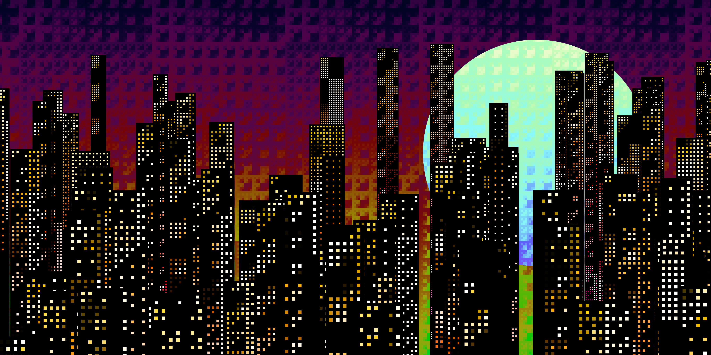
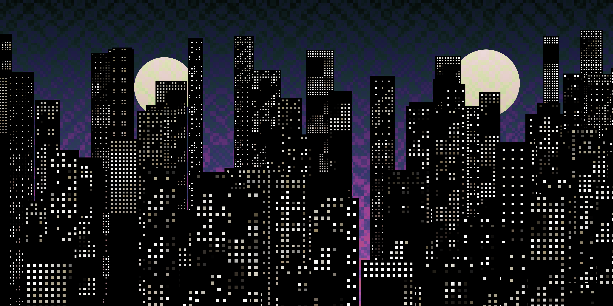
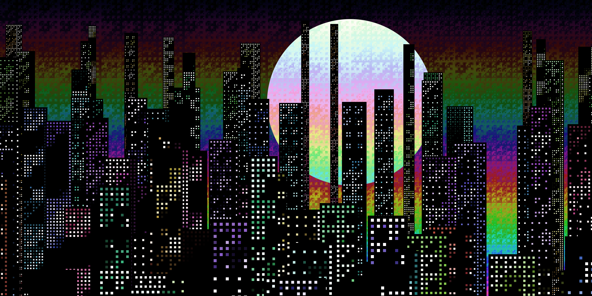
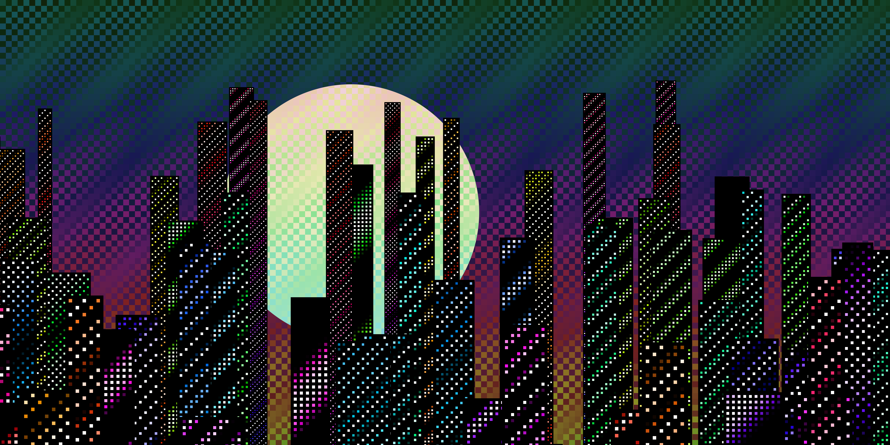

<div align="center">

# Bit Dot Night
### *Bitwise Generative Systems for Emergent Architectural Visualization*

[](https://github.com/dkconnect/bit-dot-night/blob/main/Bit%20Dot%20Night%20Rev%20-%20JULY.pdf)
[](https://bit-city.vercel.app/)
[](LICENSE)

An infinite, animated 2D procedural cityscape generated purely from discrete **bitwise logic**, **integer arithmetic**, and a **cosine luminance transform**. No noise functions (Perlin/Simplex), no pre-rendered assets, and no explicit geometric grammars—urban morphology emerges entirely from binary coordinate interactions.

<br />

<table align="center">
    <thead>
        <tr>
            <th>Visual Regime</th>
            <th>Primary Trait</th>
            <th>Example Traits</th>
        </tr>
    </thead>
    <tbody>
        <tr>
            <td><b>Operator Fields</b></td>
            <td>Binary Logic & Arithmetic</td>
            <td><code>AND</code>, <code>OR</code>, <code>XOR</code>, <code>ADD</code>, <code>MULT</code>, <code>HYBRID</code></td>
        </tr>
        <tr>
            <td><b>Palette Trait</b></td>
            <td>Spectral Hue Mapping</td>
            <td>Monochrome, Rainbow, Shifted Neon, Inverted</td>
        </tr>
        <tr>
            <td><b>Atmospherics</b></td>
            <td>Coordinate Distortions</td>
            <td>Earthquake, Thin Buildings, Mega-Moons, Dense Windows</td>
        </tr>
    </tbody>
</table>

</div>

---

<div align="center">

### Generated Output



### Trait Taxonomy

<table width="100%" align="center">
  <tr>
    <td align="center" width="33%">
      
      <br>
      <sub><b>Monochrome Palette</b></sub>
    </td>
    <td align="center" width="33%">
      
      <br>
      <sub><b>Rainbow Spectrum Shift</b></sub>
    </td>
    <td align="center" width="33%">
      
      <br>
      <sub><b>High-Contrast Neon Sky</b></sub>
    </td>
  </tr>
</table>

</div>

---

## Theoretical & Mathematical Foundations

Unlike conventional generative art that relies on continuous trigonometric compositions or Perlin noise fields, **Bit Dot Night** uses low-level integer logic as its primary generative substrate. 

### 1. Discrete Coordinate Operations
The basic coordinate field is evaluated over $x, y \in \mathbb{N}$. A binary operator function $f(x, y) = \mathcal{O}(x + s_x, y + s_y)$ applies seed offsets $(s_x, s_y)$ to inject deterministic variance:

$$\begin{aligned}
\text{AND:} \quad & f(x, y) = (x + s_x) \ \& \ (y + s_y) \\
\text{OR:} \quad & f(x, y) = (x + s_x) \ \mid \ (y + s_y) \\
\text{XOR:} \quad & f(x, y) = (x + s_x) \oplus (y + s_y) \\
\text{ADD:} \quad & f(x, y) = (x + s_x) + (y + s_y) \\
\text{MULT:} \quad & f(x, y) = (x + s_x)(y + s_y) \\
\text{HYBRID:} \quad & f(x, y) = (x - y) \oplus (x + y)
\end{aligned}$$

### 2. Periodic Cosine Luminance Mapping
Raw bitwise outputs produce sharp scalar discontinuities. To create smooth, wave-like lighting while preserving binary structure, outputs pass through a continuous periodic brightness transform:

$$L(x, y) = \cos\Big(f(x, y) \cdot k\Big)$$

where $k$ is a seed-derived scale constant modulating spatial frequency transitions.

### 3. Spectral & Empirical Analysis

Quantitative analysis over 2D Fast Fourier Transforms (2D FFT) demonstrates that each discrete operator induces a statistically distinct visual and structural regime:

| Operator | Formula | Brightness Variance ($\sigma^2$) | Low-Freq Energy ($E_{\text{low}}$) | Mid-Freq Energy ($E_{\text{mid}}$) | High-Freq Energy ($E_{\text{high}}$) | Structural Coherence ($C$) | Visual Behavior |
| :--- | :--- | :---: | :---: | :---: | :---: | :---: | :--- |
| **AND** | `X & Y` | 0.02645 | 37.6% | 19.0% | 43.4% | 0.06571 | Dense blocks, high clustering |
| **OR** | $X \ \mid \ Y$ | $0.04059$ | $57.8\%$ | $17.8\%$ | $24.4\%$ | $0.06304$ | Expanding modular forms |
| **XOR** | $X \oplus Y$ | $0.05103$ | $53.5\%$ | $15.9\%$ | $30.6\%$ | $0.08984$ | High-frequency window grids |
| **ADD** | $X + Y$ | $0.03121$ | $73.3\%$ | $10.5\%$ | $16.2\%$ | $0.06123$ | Linear directional gradients |
| **MULT** | $X \times Y$ | $0.02552$ | $71.0\%$ | $8.5\%$ | $20.5\%$ | $0.04777$ | Sparse nonlinear scaling |
| **HYBRID** | $(X-Y) \oplus (X+Y)$ | $0.04383$ | $65.3\%$ | $11.1\%$ | $23.6\%$ | $0.05958$ | Computed Moiré / chaotic symmetry |

* **Structural Coherence ($C$):** Quantifies localized pixel brightness shifts. Lower values denote smooth continuous spatial transitions (buildings/facades), while higher values reflect rapid local variation (scattered lit windows).

---

## System Architecture & Rendering Pipeline

The platform uses a dual-layer, offscreen rendering architecture to maintain $60 \text{ FPS}$ performance at ultra-high internal resolutions.

## Running Locally

No build tools or heavy framework configurations are required—just plain modern web technologies.

```
1. Clone the repository:
    git clone [https://github.com/dkconnect/bit-city.git](https://github.com/dkconnect/bit-city.git)
    cd bit-city

2. Serve the project: Use any local web server (e.g., Python's standard HTTP server or VS Code Live Server):
    Python 3.x
    python -m http.server 8000

3. Open in Browser: Navigate to http://localhost:8000.
```
---

## Repository Structure

```
.
├── index.html                           # DOM structure & asset dependencies
├── style.css                            # Layout, retro aesthetics & canvas styling
├── script.js                            # Core generative logic, PRNG, and ArtGenerator class
├── Bit Dot Night Rev - JULY.pdf         # Full formal research paper
└── README.md                            # Project documentation
```

---

## Citation & Research Paper

If you use **Bit Dot Night** or its operator taxonomy in your research, generative art, or computational media projects, please cite the paper:

```bibtex
@article{kumar2025bitdotnight,
  title={Bit Dot Night: Bitwise Generative Systems for Emergent Architectural Visualization},
  author={Kumar, Dibyanshu},
  journal={Preprint / Technical Paper},
  year={2025},
  url={[https://bit-city.vercel.app/](https://bit-city.vercel.app/)}
}

```

---
<div align="center">
    
**Created by Dibyanshu Kumar**
